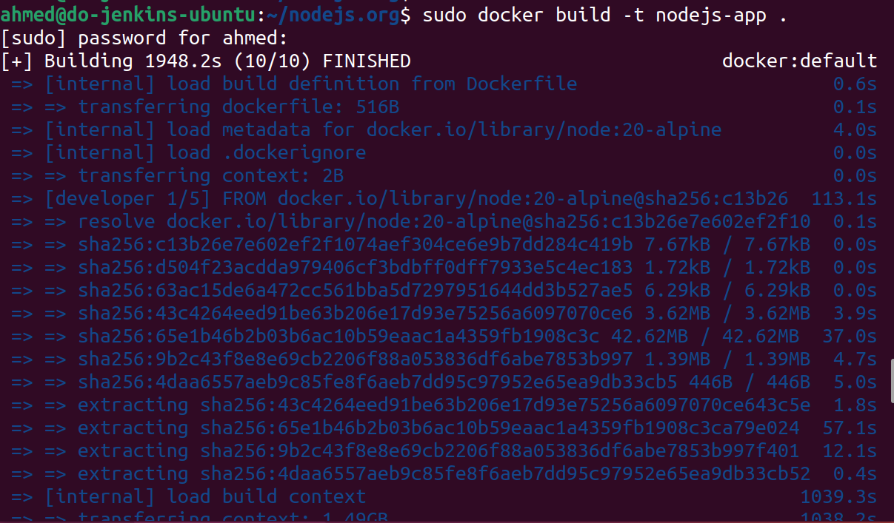
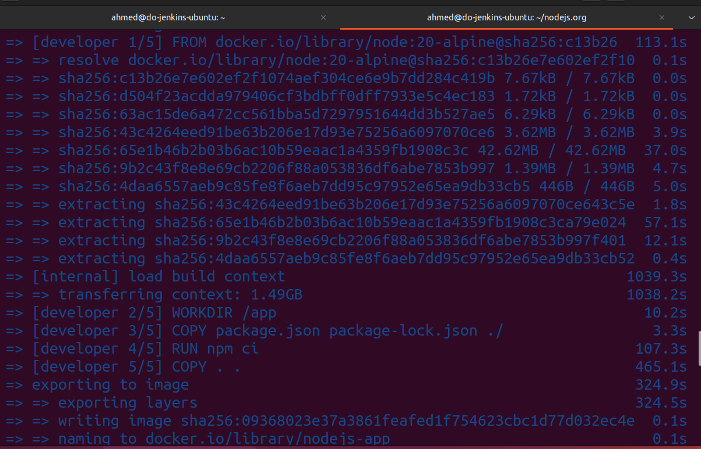

# Kubernetes Cluster with Jenkins, ArgoCD, and Node.js Application Deployment

## Overview

This project demonstrates how to deploy a **Node.js** application from a GitHub repository to a **Kubernetes cluster** using **Minikube** and **ArgoCD**. Additionally, we will configure a **Jenkins pipeline** to automate the build, testing, and deployment process, including **pushing a Docker image to DockerHub**.

---

## Prerequisites

1. **VM 1:** Jenkins Server  
   - Docker installed  
   - Jenkins installed  
2. **VM 2:** Kubernetes Cluster  
   - Minikube installed  
   - kubectl installed  
   - ArgoCD installed  
---
## Part 1: Jenkins Setup and Dockerization

### Step 1: Fork the Node.js Repository

1. Go to the **[Node.js GitHub repository](https://github.com/nodejs/nodejs.org.git)**.  
2. Click on the **Fork** button to create a copy under your GitHub account.
---

### Step 2: Clone the Repository on Jenkins VM

``bash
git clone https://github.com/<your-username>/nodejs.org.git
cd nodejs.org

### Step 3: Build the Application and Run Unit Tests Locally
Install Node.js v20 on your VM.
Navigate to the project directory and install dependencies:
npm install

Run unit tests:
npm test

### Step 4: Create a Dockerfile and Push to GitHub
Create a Dockerfile inside the project directory:

Push the Dockerfile to your GitHub repository:
git add Dockerfile
git commit -m "Add Dockerfile"
git push origin main

  
  
   
### Step 5: Set Up Jenkins Pipeline

#### pushed to dockerhub

## Kubernetes Deployment
 we will deploy the Node.js application on a local Kubernetes cluster.
We will use Minikube to set up the cluster and ArgoCD for continuous delivery.
 Additionally, a deployment.yaml file will be created and pushed to the GitHub repository for version control.

Prerequisites
-Virtual Machine (VM) for Minikube
-Minikube installed on the VM
-kubectl installed on the VM
-ArgoCD installed on Minikube
-GitHub Repository (e.g., https://github.com/MuhamedMaher/nodejs.org.git)
-A Docker Hub account with your Docker image

### Step 1: Install Minikube and kubectl
Install Minikube on your second VM:

curl -Lo minikube https://storage.googleapis.com/minikube/releases/latest/minikube-linux-amd64
sudo install minikube /usr/local/bin/

Install kubectl:

curl -LO "https://dl.k8s.io/release/$(curl -L -s https://dl.k8s.io/release/stable.txt)/bin/linux/amd64/kubectl"
chmod +x kubectl
sudo mv kubectl /usr/local/bin/

Start Minikube:
minikube start

### Step 2: Install ArgoCD on Minikube
Create a namespace for ArgoCD:
kubectl create namespace argocd

Install ArgoCD using the following command:
kubectl apply -n argocd -f https://raw.githubusercontent.com/argoproj/argo-cd/stable/manifests/install.yaml

Expose the ArgoCD server to access it locally:
kubectl port-forward svc/argocd-server -n argocd 8080:443

Log in to ArgoCD:
Open your browser and go to https://localhost:8080.
Username: admin
Password: Retrieve it using:
kubectl get secret -n argocd argocd-initial-admin-secret -o jsonpath="{.data.password}" | base64 -d

### Step 3: Create Kubernetes Deployment and Service

### Step 4: Push the Kubernetes Files to GitHub

### Step 5: Deploy the Node.js App to Kubernetes

### Step 6: Configure ArgoCD to Manage the Deployment

# Conclusion
With this setup, your Node.js application is deployed on a Kubernetes cluster using Minikube. The application is managed through ArgoCD for continuous delivery, and all changes to the k8 directory will trigger updates to the deployment.

